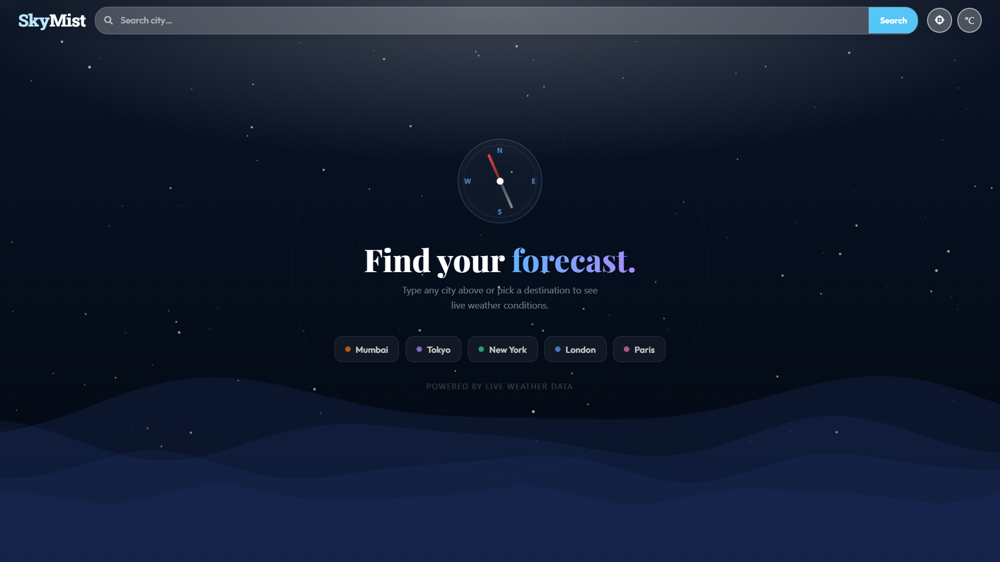

# SkyMist 🌤️

> *"Know your sky before you step outside."*

SkyMist is a simple and responsive weather forecast web application built with HTML, Tailwind CSS, Vanilla CSS, and JavaScript. It integrates with the OpenWeatherMap API to fetch live weather data and presents it. Here, every search transforms the entire page — the sky, the clouds, the waves, even the color palette — to match exactly what's happening outside in that city right now.

---

## Features

- **City Search** — Search weather by any city name worldwide
- **Current Location** — Detect and fetch weather for your current GPS location
- **Live Clock** — Shows real-time date and time in the searched city's timezone
- **Hourly Forecast** — Displays next 8 time slots (every 3 hours)
- **5-Day Forecast** — Shows temperature, humidity, wind, and weather description for 5 upcoming days
- **Recent Cities Dropdown** — Stores up to 8 recently searched cities using localStorage. Supports live filtering as you type
- **Fully Responsive** — Works on iPhone SE, iPad Mini, and desktop

---

## Tech Stack

- HTML5
- Tailwind CSS 
- Vanilla CSS 
- JavaScript 
- OpenWeatherMap API

---

## Project Structure

```
skymist/
├── index.html          # Main HTML file
├── src/
│   ├── app.js          # All JavaScript logic
│   ├── input.css       # Tailwind directives
│   └── output.css      # Compiled CSS (Tailwind + custom styles)
├── README.md
└── package.json        # Tailwind CLI dependency
```

---

## Setup Instructions

### 1. Clone the repository

```bash
git clone https://github.com/monikamittal-1728/SkyMist---Weather-Forecast.git
cd skymist
```

### 2. Install dependencies

Tailwind CSS is used via CLI. Install it with:

```bash
npm install
```

### 3. Get an API key

- Go to [https://openweathermap.org](https://openweathermap.org)
- Create a free account
- Navigate to **API Keys** in your dashboard
- Copy your API key

### 4. Add your API key

Open `src/app.js` and replace the KEY value at the top:

```javascript
const KEY = "your_api_key_here";
```

### 5. Build Tailwind CSS

Run the Tailwind CLI watcher to compile your CSS:

```bash
npm run dev
```

### 6. Open `index.html` in your browser

---

## Screenshots

### Empty State


### Haze weather


### Night Theme


### Rainy Weather


### 5-Day Forecast


### Mobile View

```

---

## 🌐 Live Demo

👉 https://skymist-weatherapp.netlify.app/ 

---

## How to Use

1. **Search a city** — Type a city name in the search bar and press Enter or click Search
2. **Use your location** — Click the crosshair button in the navbar to fetch weather for your current GPS location
3. **Switch units** — Click the °C button to toggle between Celsius and Fahrenheit
4. **Recent cities** — Click the search bar to see recently searched cities. Start typing to filter them
5. **Quick cities** — On first load, click any city button (Mumbai, Tokyo, etc.) to get started instantly

---

## API Reference

Both endpoints are from OpenWeatherMap's free tier:

**Current Weather**
```
GET https://api.openweathermap.org/data/2.5/weather?q={city}&appid={key}&units=metric
```

**5-Day Forecast (3-hour intervals)**
```
GET https://api.openweathermap.org/data/2.5/forecast?q={city}&appid={key}&units=metric
```

---

## Storage Strategy

| Storage | Key | Purpose | Clears |
|---------|-----|---------|--------|
| `localStorage` | `skyMist_recent_city` | Saves recently searched cities | Never (manual clear) |
| `sessionStorage` | `searched_city` | Saves last city for refresh restore | On tab close |

---

## A few decisions worth noting

**Why sessionStorage for last city?**
localStorage would restore the city even days later, which could show stale context. sessionStorage keeps it alive for the current browsing session — refresh works, but closing the tab starts fresh. Feels more honest for a live weather app.

**Why no alert()?**
Browser alerts block the thread and look terrible. Every error in SkyMist goes through a custom toast that appears bottom-right, auto-dismisses after 4 seconds, and can be manually closed.

---

## Important Notes

- Temperature toggle only affects today's display (current temp, feels like, hi/lo)
- Forecast cards always show °C
- Do not include `node_modules` in submission — run `npm install` after cloning

---

## Author

MONIKA MITTAL
